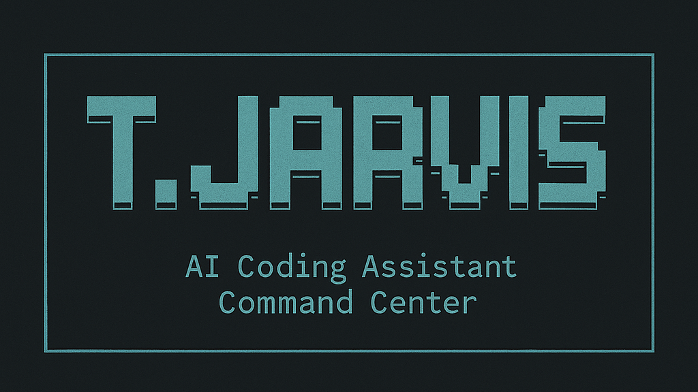

<div align="center">

# Terminal Jarvis Frankenstein



An AI coding assistant command center integration with Open Lovable. Chat with AI to build React apps instantly while managing multiple AI coding tools from one unified interface.

[](https://github.com/BA-CalderonMorales/terminal-jarvis-frankenstein)
[](https://opensource.org/licenses/MIT)
[](https://github.com/BA-CalderonMorales/terminal-jarvis-frankenstein)

</div>

## Project Overview

Terminal Jarvis Frankenstein is an enhanced version of Open Lovable that integrates with the Terminal Jarvis ecosystem. This project combines the instant React app building capabilities of Open Lovable with the unified command center approach of Terminal Jarvis.

### Integration Goals

- **Unified Command Center**: Provide a single interface to manage and run multiple AI coding tools
- **Tool Management**: Allow users to install, update, and run tools seamlessly  
- **Context Switching**: Enable users to switch between different AI coding tools effectively
- **Interactive Experience**: Leverage existing capabilities to create an engaging interface for AI coding tools

### Current Development Stage

**Early Development** - This project is in active development and should be considered experimental. Current focus areas:

- Resolving Tailwind CSS v4 compatibility issues (resolved in v0.0.1)
- Improving error handling and user feedback
- Security vulnerability remediation
- Enhanced environment variable configuration

## Quick Start

### Prerequisites

- Node.js and NPM
- API keys for required services (see configuration below)

### Installation

1. **Clone & Install**
```bash
git clone https://github.com/BA-CalderonMorales/terminal-jarvis-frankenstein.git
cd terminal-jarvis-frankenstein
npm install
```

2. **Add `.env.local`**
```env
# Required
E2B_API_KEY=your_e2b_api_key  # Get from https://e2b.dev (Sandboxes)
FIRECRAWL_API_KEY=your_firecrawl_api_key  # Get from https://firecrawl.dev (Web scraping)

# Optional (need at least one AI provider)
ANTHROPIC_API_KEY=your_anthropic_api_key  # Get from https://console.anthropic.com
OPENAI_API_KEY=your_openai_api_key  # Get from https://platform.openai.com
GEMINI_API_KEY=your_gemini_api_key  # Get from https://aistudio.google.com/app/apikey
GROQ_API_KEY=your_groq_api_key  # Get from https://console.groq.com
```

3. **Run Development Server**
```bash
npm run dev
```

Open [http://localhost:3000](http://localhost:3000)

## Features

### Current Capabilities

- **AI-Powered React Development**: Chat interface for building React applications
- **Multiple AI Provider Support**: Anthropic Claude, OpenAI, Google Gemini, Groq
- **E2B Sandbox Integration**: Secure code execution environment
- **Firecrawl Web Scraping**: Enhanced web content analysis
- **Real-time Code Generation**: Streaming AI code generation and application

### In Development

- Terminal Jarvis tool integration
- Enhanced command center interface
- Multi-tool management system
- Template workflow automation

## Documentation

- **[Setup Instructions](docs/SETUP_INSTRUCTIONS.md)** - Detailed installation and configuration
- **[Integration Guide](docs/INTEGRATION_WITH_TERMINAL_JARVIS.md)** - Terminal Jarvis integration overview
- **[Package Detection](docs/PACKAGE_DETECTION_GUIDE.md)** - Automated dependency management
- **[Streaming Fixes](docs/STREAMING_FIXES_SUMMARY.md)** - Real-time code generation improvements

## Testing

Run the test suite to verify functionality:

```bash
# Run all tests
npm run test:all

# Individual test suites
npm run test:integration  # E2B integration tests
npm run test:api         # API endpoint tests
npm run test:code        # Code execution tests
```

## Contributing

This project welcomes contributions. Given the early development stage:

1. Check existing issues and documentation
2. Review [CHANGELOG.md](CHANGELOG.md) for recent changes and version history
3. Test thoroughly in development environment
4. Follow semantic commit conventions
5. Ensure no sensitive information in commits

## Project Origins

**Terminal Jarvis Frankenstein**: [https://github.com/BA-CalderonMorales/terminal-jarvis-frankenstein](https://github.com/BA-CalderonMorales/terminal-jarvis-frankenstein)

**Original Implementation (Open Lovable)**: [https://github.com/mendableai/open-lovable](https://github.com/mendableai/open-lovable)

This project builds upon the excellent foundation provided by the Firecrawl team's Open Lovable implementation.

## License

MIT
